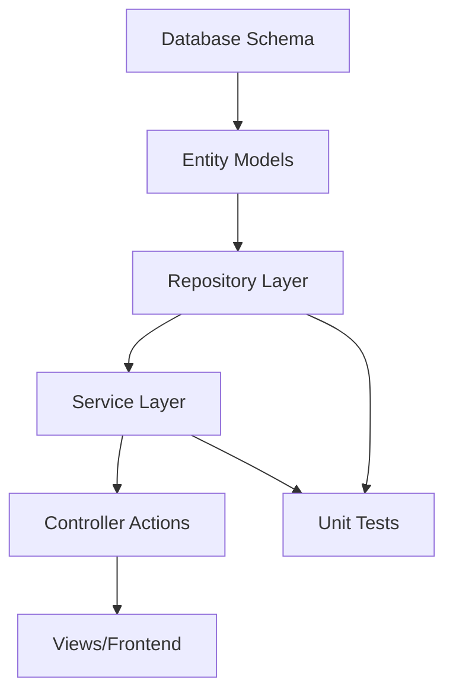

# Deep Dive: Mastering Cursor Rules for Deterministic Code Generation

## Part 1: Structural Architecture for Cursor Rules

### Core Structural Principles

The fundamental challenge in cursor rule design is creating a system that produces **deterministic outputs** while maintaining **token efficiency** and handling **abstract principles**. Here's the optimal structure:

#### 1. **Hierarchical Rule Organization**

```markdown
# Project Rules

## 1. CONTEXT DECLARATION
### Tech Stack
- PRIMARY: ASP.NET Core MVC (v8.0)
- DATABASE: SQLite via EF Core
- FRONTEND: sb-admin-2 template
- HOSTING: AWS (specify: EC2/Lambda/ECS)

## 2. IMMUTABLE PRINCIPLES
### MUST Requirements
- MUST use async/await for ALL database operations
- MUST implement Repository pattern for data access
- MUST NOT expose Entity models directly to Views

### Architecture Boundaries
- Controllers → Services → Repositories → DbContext
- NEVER skip layers (e.g., Controller → Repository)

## 3. CONTEXTUAL RULES
### When working in @Controllers/*
- Reference: @Models/ViewModels/* for data transfer
- Pattern: Thin controllers, fat services
- Validation: FluentValidation in service layer

### When working in @Data/Repositories/*
- MUST return IQueryable for composable queries
- MUST NOT materialize collections prematurely
- Reference: @Data/Entities/* for model definitions
```

This structure leverages **cascading specificity** - general rules at the top, specific contextual rules below. The LLM processes rules in order, allowing later rules to override earlier ones when appropriate.

#### 2. **State Management Through Markers**

```markdown
## WORKFLOW STATE
<!-- Current Focus: Feature/UserAuthentication -->
<!-- Phase: Implementation -->
<!-- Completed: Database schema, Entity models -->
<!-- Next: Service layer implementation -->

## ACTIVE CONVENTIONS
- Naming: PascalCase for public, camelCase for private
- Files: One class per file, matching class name
- Tests: xUnit with FluentAssertions
```

State markers serve as **working memory** for the LLM, reducing the need to infer context from conversation history. This dramatically improves consistency across multiple interactions.

#### 3. **Reference-Based Context Loading**

```markdown
## REFERENCE PATTERNS
### For Service Implementation
- ANALYZE: @Services/Interfaces/I*.cs for contracts
- FOLLOW: @Services/Base/BaseService.cs for patterns
- TEST-AGAINST: @Tests/Services/*Tests.cs for coverage

### For Database Changes
- CHECKPOINT: @Data/Migrations/* for history
- MODIFY: @Data/ApplicationDbContext.cs
- GENERATE: Migration via 'dotnet ef migrations add'
```

The `@` referencing system creates **explicit dependency chains**. Instead of the LLM guessing what files to consider, you're providing a deterministic path through the codebase.

### Advanced Techniques for Determinism

#### 1. **Constraint Propagation Through Examples**

Rather than abstract rules, provide **minimal viable examples** that demonstrate the pattern:

```markdown
## PATTERN: Repository Implementation
### INSTEAD OF:
"Implement repositories using generic base class with SOLID principles"

### USE:
```csharp
// @Data/Repositories/UserRepository.cs
public class UserRepository : BaseRepository<User>, IUserRepository
{
    public UserRepository(AppDbContext context) : base(context) { }
    
    public async Task<User?> GetByEmailAsync(string email)
    {
        return await _dbSet
            .Include(u => u.Roles)
            .FirstOrDefaultAsync(u => u.Email == email);
    }
}
```
// KEY PATTERNS:
// 1. Inherit from BaseRepository<T>
// 2. Explicit interface implementation
// 3. Async methods with Async suffix
// 4. Include related data explicitly
```

This approach leverages the LLM's pattern matching capabilities while remaining token-efficient.

#### 2. **Conflict Resolution Through Priority Chains**

```markdown
## CONFLICT RESOLUTION
Priority Order (highest first):
1. Security requirements (MUST validate, MUST authorize)
2. Data integrity (MUST use transactions, MUST validate FK)
3. Performance (SHOULD use caching, SHOULD minimize queries)
4. Code style (PREFER early returns, PREFER LINQ methods)

### Example Resolution:
// If performance suggests raw SQL but security requires parameterization:
// → Security wins: Use parameterized EF Core query
```

This creates a **deterministic decision tree** for the LLM when principles conflict.

## Part 2: Workflow Engineering for Different Tasks

### A. Bug Fixing Workflow (Minimal Context)

```markdown
## WORKFLOW: Bug Fix
### PHASE 1: Triage
1. LOCATE: Search for error string in @Logs/*
2. IDENTIFY: Map stack trace to @{FileName}:{LineNumber}
3. SCOPE: Load only:
   - Error location ±20 lines
   - Direct dependencies via @References
   - Related test file @Tests/*

### PHASE 2: Diagnosis
```yaml
Check Sequence:
  - Input validation present?
  - Null checks implemented?
  - Async deadlock possible?
  - Transaction scope correct?
  - Connection disposal proper?
```

### PHASE 3: Fix Implementation
TEMPLATE:
```csharp
// BUG: {Description}
// ROOT CAUSE: {Identified issue}
// FIX: {Solution approach}

[Minimal code change here]

// VERIFICATION: {How to verify fix}
```
```

This workflow **minimizes token usage** by loading only essential context while maintaining a systematic approach.

### B. Feature Development Workflow

```markdown
## WORKFLOW: Feature Implementation
### INPUT: User Story
"As a {role}, I want {feature} so that {benefit}"

### PHASE 1: Technical Decomposition
1. EXTRACT entities → @Data/Entities/*
2. DEFINE interfaces → @Services/Interfaces/*
3. PLAN migrations → @Data/Migrations/*
4. DESIGN ViewModels → @Models/ViewModels/*

### PHASE 2: Implementation Order


### PHASE 3: Implementation Template
For each component:
1. CHECK existing patterns in @{ComponentType}/*
2. IMPLEMENT following established pattern
3. TEST against @Tests/{ComponentType}/*
4. INTEGRATE with upstream/downstream components
```

This creates a **deterministic path** from user story to implementation.

### C. System-Wide Refactoring Workflow

```markdown
## WORKFLOW: Refactoring
### SETUP: Analysis Phase
```python
# Pseudo-code for LLM interpretation
for file in @**/*.cs:
    if contains(anti_pattern):
        mark_for_refactoring(file)
    analyze_dependencies(file)
    calculate_risk_score(file)

sort_by_risk(marked_files, ascending=true)
```

### EXECUTION: Progressive Enhancement
1. START with lowest-risk files
2. For each file:
   - SNAPSHOT: Current state
   - REFACTOR: Apply pattern
   - VERIFY: Run @Tests/*
   - COMMIT: If tests pass
   - ROLLBACK: If tests fail

### VALIDATION: Ensure Invariants
MUST maintain:
- Public API signatures
- Database schema compatibility
- Existing test coverage
```

## Token Efficiency Strategies

### 1. **Lazy Context Loading**

```markdown
## CONTEXT LOADING RULES
DEFAULT: Load nothing
IF task involves "authentication":
    LOAD: @Security/*, @Models/Auth/*
IF task involves "database":
    LOAD: @Data/ApplicationDbContext.cs, relevant @Data/Entities/*
IF task involves "API":
    LOAD: @Controllers/Api/*, @Models/DTOs/*
```

### 2. **Template Compression**

Instead of repeating patterns, reference templates:

```markdown
## TEMPLATES
### T1: Standard Service Method
```csharp
public async Task<Result<T>> {MethodName}Async({Parameters})
{
    try
    {
        // Validation
        // Business logic
        // Repository call
        // Return Result.Success(data)
    }
    catch (Exception ex)
    {
        _logger.LogError(ex, "{MethodName} failed");
        return Result.Failure<T>(ex.Message);
    }
}
```

USE: Apply T1 for all service methods
```

### 3. **Incremental Refinement**

```markdown
## GENERATION STRATEGY
1. FIRST PASS: Generate skeleton following patterns
2. REVIEW: Check against MUST rules only
3. REFINE: Apply SHOULD rules if context allows
4. OPTIMIZE: Apply PREFER rules if tokens remain
```

## Key Insights for Deterministic Generation

1. **Explicit Over Implicit**: Always specify exact file paths, method names, and patterns rather than leaving interpretation to the LLM.

2. **Progressive Disclosure**: Start with minimal context and add only when the LLM requests or when errors occur.

3. **Pattern Libraries**: Build a library of successful patterns from your codebase and reference them rather than describing them.

4. **Stateful Workflows**: Maintain explicit state about what's been completed to avoid regenerating or reconsidering settled decisions.

5. **Verification Checkpoints**: Include explicit verification steps that the LLM must confirm before proceeding.

The key to mastering cursor rules is understanding that LLMs are **pattern matching engines** rather than reasoning engines. By providing clear patterns, explicit context, and deterministic workflows, you transform the probabilistic nature of LLMs into predictable, high-quality code generation.